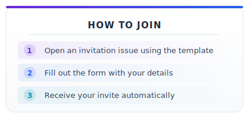
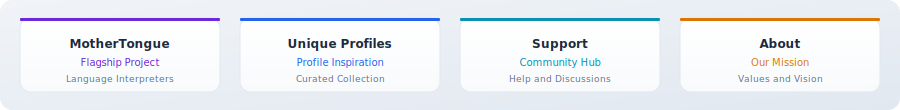

<p align="center">
  
</p>

<p align="center">
  <a href="https://github.com/orgs/Jaidevstudio/people"></a>
  <a href="https://github.com/Jaidevstudio"></a>
  <a href="https://github.com/Jaidevstudio/support/issues?q=label%3A%22invite+me+to+the+organisation%22"></a>
  <a href="https://github.com/Jaidevstudio/support/stargazers"></a>
</p>

<p align="center">
  <a href="https://github.com/Jaidevstudio/support/issues/new?template=invitation.yml"></a>
  <a href="https://discord.gg/wXFWgsAuzR"></a>
  <a href="https://jaidevstudio.netlify.app/"></a>
</p>


<br/>

## About This Repository

This is the central hub for the **Jaidevstudio** open-source community. Whether you want to join the organization, get help with a project, share ideas, or connect with fellow developers -- this is the place.

Our automated systems handle membership invitations so you can get started within minutes.

<br/>


<br/>

## Join the Organization

<p align="center">
  
</p>

<p align="center">
  <strong><a href="https://github.com/Jaidevstudio/support/issues/new?template=invitation.yml">Click here to submit your invitation request</a></strong>
</p>

Joining is free, open to everyone, and processed automatically. Once submitted, the system validates your account and sends the invitation. You will receive a comment on your issue with next steps.

### After You Join

1. **Accept the invitation** -- check your email or visit https://github.com/orgs/Jaidevstudio/invitation
2. **Set membership to Public** -- go to https://github.com/orgs/Jaidevstudio/people, find your name, click the dropdown, select **Public**
3. **Pick a project** -- browse our repositories below and look for issues labeled `good first issue`

<details>
<summary><strong>Visual guide: Setting membership to Public</strong></summary>

<br/>

Navigate to the organization members page:


Search for your username:


Change from Private to Public:


</details>

<br/>


<br/>

## Our Projects

<p align="center">
  
</p>

| Repository | Description | Links |
|:-----------|:------------|:------|
| **MotherTongue Connect To World** | Building interpreters for every mother language -- proving technology has no linguistic limits | [Repo](https://github.com/Jaidevstudio/MotherTongue) |
| **Unique Github Profiles** | Curated collection of inspiring GitHub profile READMEs for ideas and inspiration | [Repo](https://github.com/Jaidevstudio/Unique-Github-Profiles) |
| **Support** | Community hub for help, membership, and discussions (you are here) | [Issues](https://github.com/Jaidevstudio/support/issues) |
| **About** | Our community values, mission, and core beliefs | [Repo](https://github.com/Jaidevstudio/about) |
| **Member.json** | Member directory and welcome greeting for the community | [Repo](https://github.com/Jaidevstudio/Member.json) |

<br/>


<br/>

## How to Contribute

```
Fork the repo          Create a branch         Make changes
you want to      -->   for your feature   -->  and commit with
work on                                        clear messages
      |
      v
Push to your fork
and open a PR     -->  Maintainer reviews  --> Merged
```

**Where to start:**

- Look for issues labeled **`good first issue`** in any of our repositories
- Check the [issue queue](https://github.com/jaidevstudio/support/issues) for open tasks
- Join [Discord](https://discord.gg/wXFWgsAuzR) and ask in the `#first-timers` channel

**Contribution steps:**

1. **Fork** the repository
2. **Clone** your fork locally
3. **Create a branch** -- `git checkout -b my-feature`
4. **Commit** your changes with descriptive messages
5. **Push** to your fork and open a **Pull Request**
6. A maintainer will review and merge your work

<br/>


<br/>

## Guide

### Issues

Use [Issues](https://github.com/jaidevstudio/support/issues) for actionable items:

- Organization invitation requests
- Bug reports
- Feature requests
- Portfolio, resume, or open-source project reviews

### Discussions

Use [Discussions](https://github.com/jaidevstudio/support/discussions) for conversation:

- General questions
- Ideas and brainstorming
- Showcasing your work for community feedback

<br/>


<br/>

## FAQ

<details>
<summary><strong>What is a GitHub Organization?</strong></summary>
<br/>
A way to group repositories and people under one entity. Examples: <a href="https://github.com/Netflix">Netflix</a>, <a href="https://github.com/facebook">Facebook</a>, and <a href="https://github.com/jaidevstudio">Jaidevstudio</a>. Learn more on <a href="https://docs.github.com/en/github/setting-up-and-managing-organizations-and-teams/about-organizations">GitHub docs</a>.
</details>

<details>
<summary><strong>How do I join?</strong></summary>
<br/>
<a href="https://github.com/Jaidevstudio/support/issues/new?template=invitation.yml">Submit an invitation request</a>. The automated pipeline processes it within minutes.
</details>

<details>
<summary><strong>How do I keep my fork up to date?</strong></summary>
<br/>
Add a remote called <code>upstream</code> pointing to the original repo:

```bash
git remote add upstream https://github.com/Jaidevstudio/REPO_NAME.git
git fetch upstream
git merge upstream/main
```
</details>

<details>
<summary><strong>How do I get started with open source?</strong></summary>
<br/>
Start by making your first pull request in this repository. Contributing to open source is not just about code -- it is about collaboration, communication, and adding value. If you need help, ask in our Discord.
<br/><br/>
Resources:
<ul>
  <li><a href="https://github.com/jaidevstudio/support/issues/">How to get started with Robot Projects</a></li>
  <li><a href="https://github.com/jaidevstudiorobot">Open source tips from Robot Jai</a></li>
  <li><a href="./tips/finding-open-source-projects.md">Finding Open Source Projects</a></li>
</ul>
</details>

<br/>


<br/>

<p align="center">
  <a href="https://discord.gg/wXFWgsAuzR"></a>
  <a href="https://jaidevstudio.netlify.app/"></a>
  <a href="mailto:jaidevstudio.org@gmail.com"></a>
</p>

<p align="center">
  <sub>Built with purpose by the Jaidevstudio community</sub>
</p>
